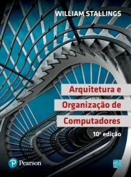

# Disciplina Arquitetura e Organização de Computadores

Evolução histórica das arquiteturas de computadores. Fundamentos de aritmética computacional. Caracterização da organização de sistemas de computação e detalhamento de subsistemas – memória, processador, dispositivos de entrada e saída de dados e barramentos. Estudo de um conjunto de instruções e modos de endereçamento utilizados por um sistema de computação. Caracterização de arquiteturas de computadores. Conceituação de Arquiteturas Paralelas.

## Bibliografia

STALLINGS, William. Arquitetura e organização de computadores. 10.ed. São Paulo: Pearson Pratice Hall, 2018.
