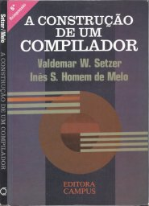
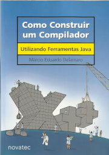

# Disciplina Compiladores

Características de linguagens: variáveis, expressões, escopo, comandos, tipagem, procedimentos, tipos de dados, abstração, controle. Análise léxica e sintática. Tabelas de símbolos. Esquemas de tradução. Ambientes de tempo de execução. Representação intermediária. Análise semântica. Geração de código. Otimização de código. Interpretadores

## Introdução

Conforme [Steve Yegge](https://en.wikipedia.org/wiki/Steve_Yegge), que foi gerente de desenvolvimento na Amazon, e engenheiro de software na Google, em seu *blog post* "[Rich Programmer Food](http://steve-yegge.blogspot.com/2007/06/rich-programmer-food.html)" :

> "Se você não conhece como os compiladores funcionam, então não sabe como os computadores funcionam. E por outro lado, se você não tem 100% de certeza de como compiladores funcionam, então não os conhece."

> "Construção de compiladores é (...) a segunda disciplina mais importante que você pode ter em um curso de graduação em Ciências da Computação."

> "Sistemas Operacionais, Aprendizado de Máquina, Computação Distribuída, e Construção de Algoritmos são tão importantes quanto Compiladores. Exceto pelo fato de que você continuará sem saber como os computadores funcionam."

Desenvolver compiladores geralmente é uma tarefa árdua, porém é uma oportunidade de aprender a utilizar várias áreas da ciência da computação em uma implementação. Esse conhecimento adquirido pode ser utilizado em diversas outras aplicações, não se limitando a compiladores

Conhecer o funcionamento do compilador é importante para poder extrair o máximo de seus recursos, como por exemplo, durante a fase de depuração de um sistema. Além disso, ele é um programa de computador, e vários são de código livre e podem ser modificados pelo programador para atender uma demanda em especial, caso necessário

A disciplina Compiladores, apesar do nome, não se limita apenas a compiladores, abrangendo outras áreas como: interpretadores, arquitetura dos ambientes e linguagens de programação, de que forma os programas podem ser otimizados para execução em arquiteturas de computador, projeto de novas arquiteturas, simulação compilada, ferramentas de produtividade de software, processamento de linguagem natural, como extrair desempenho da arquitetura para aplicações científicas, como melhor utilizar os recursos dos compiladores (ou interpretadores) em aplicações e arquiteturas de IoT, dentre outras

## Bibliografia

### Básica

- [AHO, A. V. et al. *Compiladores: princípios, técnicas e ferramentas*. São Paulo: Pearson.](https://www.amazon.com.br/Compiladores-princ%C3%ADpios-ferramentas-Alfred-Aho/dp/8588639246)
- [SETZER, V. W.; MELO, I. S. H. *A construção de um compilador*. Rio de Janeiro: Campus.](https://drive.google.com/open?id=1MjaJMJs9zEluTe91UWIc__FM6zJY-ccn)
- [DELAMARO, M. *Como Construir um Compilador Utilizando Ferramentas Java*.](https://sites.icmc.usp.br/delamaro/SlidesCompiladores/CompiladoresFinal.pdf)

### Complementar

- [LOUDEN KENNETH, C. *Compiler Construction: Principles and Practice*. Course Technology, 1997.](https://books.google.com.br/books?id=vXchAQAAIAAJ)
- [LOUDEN, Kenneth C. et al. *Programming languages: principles and practices*. Cengage Learning, 2011.](https://books.google.com.br/books?id=DcgIAAAAQBAJ)
- [GRUNE, Dick et al. *Modern compiler design*. Springer Science & Business Media, 2012.](https://books.google.com.br/books?id=zkpFTBtK7a4C)
- [WIRTH, N. *Algorithms + Data Structures = Programs*. Prentice-Hall, 1976.](https://books.google.com.br/books?id=O6FQAAAAMAAJ)
- [COOPER, Keith; TORCZON, Linda. *Construindo Compiladores*. Elsevier Brasil, 2017.](https://books.google.com.br/books?id=rJKoBQAAQBAJ)
- [FISCHER, C. N.; CYTRON, R. K.; LEBLANC Jr., R. J. *Crafting a Compiler*. 2010.](https://books.google.com.br/books?id=GSYrAAAAQBAJ)
- [PRICE, A. M. de A.; TOSCANI, S. S. *Implementação de linguagens de programação: compiladores*. Sagra-Luzzatto, 2001.](https://books.google.com.br/books?id=O7ZzPgAACAAJ)

#### TCCs

- [TOMAZELLI, G. *Implementação de um compilador para uma linguagem de programação com geração de código Microsoft .NET Intermediate Language*. 2004.](http://campeche.inf.furb.br/tccs/2004-I/2004-1giancarlotomazellivf.pdf)
- [BERGSTEN, N. A. L. *Um compilador Portugol-assembly para microcontrolador*. 2012.](http://www.ecomp.uefs.br/data/tcc/UM%20COMPILADOR%20PORTUGOL-ASSEMBLY%20PARA%20MICROCONTROLADOR.pdf)

### Sites

Sites de outros Professores contendo informações úteis sobre compiladores

- [Prof. Valdemar Setzer](https://www.ime.usp.br/~vwsetzer/)
- [Prof. Márcio Delamaro](https://sites.icmc.usp.br/delamaro/)
- [Prof. Marcurs Ramos](http://www.marcusramos.com.br/univasf/)
- [Prof. Guilherme Galante](https://sites.google.com/site/guigalante/home/compiladores-2016)
- [Prof. Sérgio Costa](https://profsergiocosta.github.io/teaching/compiladores)
- [Prof. Aleardo Manacero](https://www.dcce.ibilce.unesp.br/~aleardo/cursos/compila/index.html)

### Links

Informações diversas relacionadas a compiladores

- [Por que Pascal ?](pascal.md)
- [*Why you should take a Compilers course*](https://anoopsarkar.github.io/compilers-class/assets/lectures/in1-evangelize-compilers.pdf)
- [*(When) Should I learn compilers*?](https://stackoverflow.com/questions/733093/when-should-i-learn-compilers)
- [Compilador](https://pt.wikipedia.org/wiki/Compilador)
- [Interpretador](https://pt.wikipedia.org/wiki/Interpretador)
- [Linker](https://pt.wikipedia.org/wiki/Ligador)
- [GNU *Compiler Collection* (GCC)](https://en.wikipedia.org/wiki/GNU_Compiler_Collection) 
- [GNU Pascal (GPC)](https://en.wikipedia.org/wiki/GNU_Pascal)
- [GCC vs. Clang/LLVM: *An In-Depth Comparison of C/C++ Compilers*](https://medium.com/@alitech_2017/gcc-vs-clang-llvm-an-in-depth-comparison-of-c-c-compilers-899ede2be378)
- [Repositório da disciplina "Compiladores" do curso Ciência da Computação do CEULP/ULBRA](https://github.com/jacksongomesbr/academia-compiladores)
- [*Free Grammars for Programming Languages* - C. Heng](https://www.thefreecountry.com/sourcecode/grammars.shtml)
- [*Free Compilers and Interpreters* - C. Heng](https://www.thefreecountry.com/compilers/index.shtml)
- [*Compiler Construction* - Wikibooks](https://en.wikibooks.org/wiki/Compiler_Construction)
- [GNU C *Compiler Internals* - Wikibooks](https://en.wikibooks.org/wiki/GNU_C_Compiler_Internals)
- [*How to Write a Compiler* - Wikibooks](https://en.wikibooks.org/wiki/How_to_Write_a_Compiler)
- [Inger - interpretador simples e documentação](http://inger.sourceforge.net/html/about.html)
- [Writing your own programming language and compiler with Python](https://blog.usejournal.com/writing-your-own-programming-language-and-compiler-with-python-a468970ae6df)
- [Compiler Design Tutorial](https://www.javatpoint.com/compiler-tutorial)
- [*Compiler Design and Construction* - FreeTechBooks](https://www.freetechbooks.com/compiler-design-and-construction-f14.html)
- [*Compiler - Digital Library* - stmik-banjarbaru.ac.id](http://digilib.stmik-banjarbaru.ac.id/index.php?dir=&search=compiler&search_mode=f)
- [Compiler Design Tutorial](https://www.guru99.com/compiler-design-tutorial.html)

### Ferramentas

- Compilador educativo Verto
  - http://www.cinted.ufrgs.br/renoteold/nov2005/artigosrenote/a19_verto.pdf
  - http://www.cinted.ufrgs.br/renoteold/nov2005/apresentacoes/ap19_verto.pdf
  - http://verto.sourceforge.net
- Máquina Hipotética Cesar
  - http://www.inf.ufrgs.br/arq/wiki/doku.php?id=cesar
  - https://pt.wikipedia.org/wiki/M%C3%A1quinas_hipot%C3%A9ticas_da_Universidade_Federal_do_Rio_Grande_do_Sul
- Computador hipotético HIPO
  - https://www.ime.usp.br/~vwsetzer/HIPO/hipo-descr.html
  - https://www.ime.usp.br/~vwsetzer/HIPO/using-the-HIPO-simulator.html
  - https://seijihariki.github.io/HIPO-simulator
  - https://github.com/seijihariki/HIPO-simulator
  - https://www.ime.usp.br/~jstern/miscellanea/MaterialDidatico/hipo.htm
  - https://www.ime.usp.br/~jstern/software/hipo/Hipo.pdf
  - [Exemplo de código](hipo.md)
- Compilador online interativo que permite inserir código fonte em C e ver o código objeto gerado em *assembly*
    - Compiler Explorer: https://godbolt.org/
    - penguinTrace: https://penguintrace.org/intro/
- Jupyter Notebook (ambiente interativo incluindo documentação)
    - https://docs.microsoft.com/pt-br/azure/cosmos-db/cosmosdb-jupyter-notebooks
    - https://jupyter.readthedocs.io/pt_BR/latest/
    - https://www.youtube.com/results?search_query=jupyter+notebook

  

