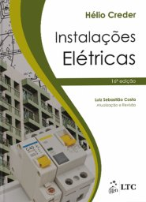

# Disciplina

Elementos de circuitos de corrente contínua, lei de Ohm, potência em corrente contínua, teoremas de Thevenin e Norton. Circuitos de corrente alternada, métodos das malhas para a resolução de circuitos, potência em corrente alternada, teorema da máxima transferência de potência e correção do fator de potência.

## Bibliografia

