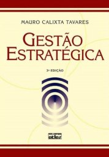
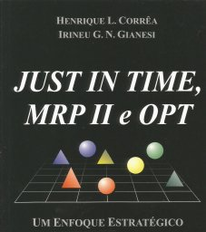

# Disciplina Planejamento Estratégico da Produção

Aspectos gerais dos sistemas de produção. Planejamento estratégico de produção. Modelos de maturidade da função produção. Previsão de demanda. Planejamento mestre da produção. Programação da produção. Sistemas avançados de planejamento e controle da produção.

## Bibliografia

TAVARES, Mauro Calixta. *Gestão estratégica*. 3. ed. São Paulo: Atlas, 2010.

SLACK, N.; LEWIS, M. *Estratégia de Operações*. 2. ed. Porto Alegre: Bookman, 2009.

CORREA. H.; GIANESI. I. *Just in Time, MRP II e OPT*: um enfoque estratégico. 2. ed. São Paulo: Atlas, 2011.
