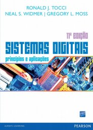

# Disciplina Sistemas Digitais

Sistemas de numeração. Álgebra de Boole. Circuitos combinacionais. Circuitos sequenciais síncronos e assíncronos (“Flip-Flops e Dispositivos Correlatos”). Famílias de circuitos lógicos. Dispositivos lógicos programáveis. Gate Arrays. Análise e projeto de sistemas digitais.

## Bibliografia

TOCCI, Ronald J. ; WIDMER, Neal S.. *Sistemas Digitais*: princípios e aplicações. 11 ed. Rio de Janeiro: Pearson, 2011.
