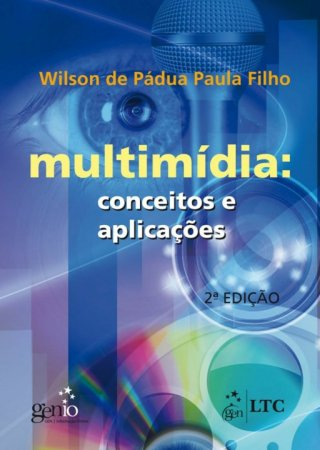

# Disciplina Tópicos Especiais

Multimídia: conceitos e tipos de sistemas. Tipografia. Áudio: processamento e síntese de som. Imagem. Vídeo: interfaces e processamento. Animação. Interação. Autoria: plataformas para multimídia. Ferramentas de desenvolvimento. Realidade Virtual: conceitos, tipos de sistemas e tecnologias afins. Dispositivos não convencionais de entrada e saída. Software e linguagens para desenvolvimento de aplicações de realidade virtual. Modelagem e animação tridimensional

## Bibliografia

PAULA FILHO, Wilson de Padua. *Multimídia: conceitos e aplicações*. Rio de Janeiro: LTC, 2000

